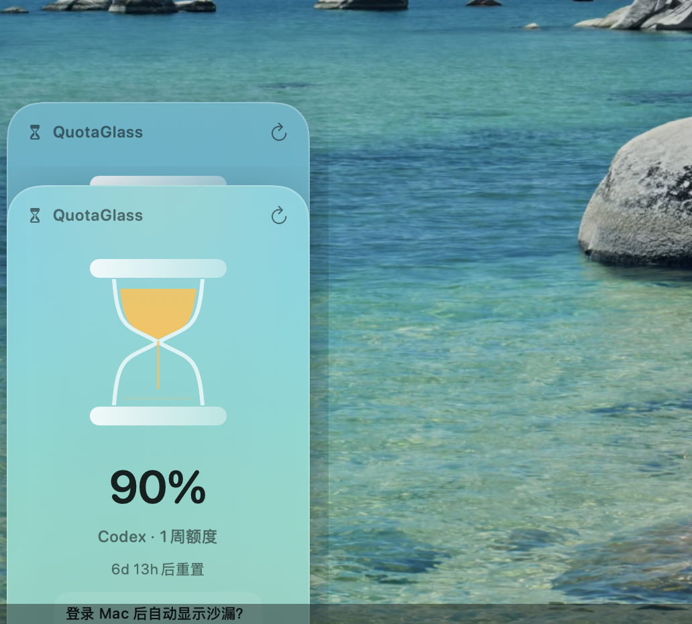

# QuotaGlass

[English](README.md) · [简体中文](README.zh-CN.md)

QuotaGlass 是一个轻量的原生 macOS 桌面沙漏，让你随时看到 Codex 的剩余额度。

## 下载

前往 [GitHub Releases](https://github.com/qshine/Codex-QuotaGlass/releases/latest) 下载最新版 Apple Silicon DMG。

## 功能

- 用动态沙漏展示当前最紧张的 Codex 额度窗口。
- 收到实时额度通知后立即更新，并每 45 秒进行一次兜底刷新。
- 常显剩余百分比、额度窗口名称和重置倒计时。
- 整张卡片均可拖动，并会在下次打开时恢复位置。
- 在所有 Space 中保持全局唯一的桌面摆件。
- 通过右键菜单提供立即刷新、登录时启动、打开客户端和退出等操作。
- 数据过期时明确显示陈旧状态，不会继续冒充实时额度。

## 系统要求

- Apple Silicon Mac
- macOS 14 或更高版本
- 已安装并登录官方 ChatGPT/Codex 桌面客户端

## 额度选择规则

QuotaGlass 通过本机安装的官方 Codex App Server 读取额度信息。当存在多个额度窗口时，它会显示剩余百分比最低的窗口；若百分比相同，则优先选择重置时间更晚的窗口，最后优先选择 primary 窗口。

## 隐私

QuotaGlass 不包含分析统计，也不依赖自建云服务。它不会读取浏览器 Cookie、ChatGPT 数据库或登录令牌。本地仅保存归一化后的额度、重置时间、摆件位置和登录时启动偏好。

## 分发说明

0.0.1 是面向 Apple Silicon 的预览版本，使用 ad-hoc 签名，暂未通过 Apple Developer ID 公证。
